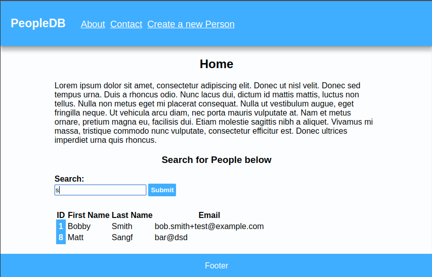
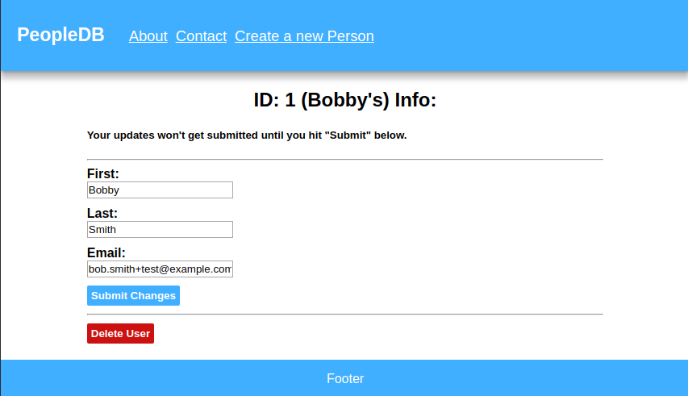
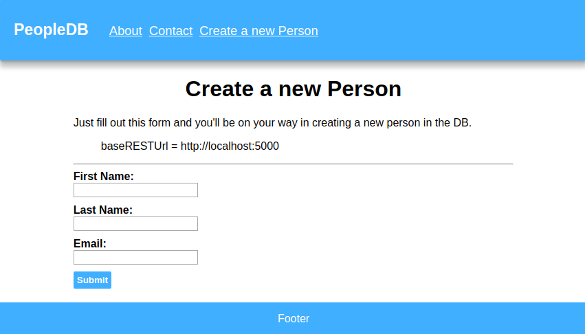

# Peopledb-py-react

Person Database using python, flask, sqlite3, react.

## Installing
- Install deps from pkg manager
    - Ubuntu:
        - `$ sudo apt install python3 python3-pip sqlite3 nodejs npm`
    - Arch:
        - `$ sudo pacman -S sqlite3 nodejs npm python3 python3-pip`
- Install python pip pkgs
    - `$ sudo pip3 install flask flask-cors pysqlite3 `
- Clone this repo
    - `$ git clone https://github.com/ssebs/PeopleDB-py-react`
- cd to the new folder
    - `$ cd Peopledb-py-react/`
- Clone the [flask-ppl-api repo](https://github.com/ssebs/flask-ppl-api)
    - `$ git clone https://github.com/ssebs/flask-ppl-api`
- cd to the new folder & run the init script
    - `$ cd flask-ppl-api/`
    - `$ ./init_db.sh`
- Go back and install npm deps
    - `$ cd ../peopledb/`
    - `$ npm install`

## Running dev
> You'll need two terminals open
- `$ make api`
    - ^ Will run python flask server (:5000)
- `$ make frontend`
    - ^ Will run npm start live dev server (:3000)

## Building
- Frontend:
    - `$ make build`
- Backend: (TEMP)
    - `$ nohup /usr/bin/python3 /var/www/PeopleDB-py-react/flask-ppl-api-main.py &`

## Screenshots

### Home / Search page

### Detailed info / modify/delete page

### Create new user page

